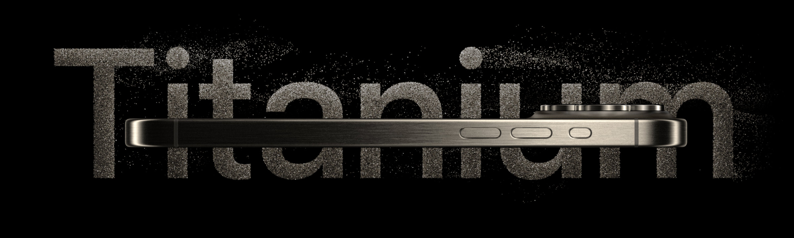

# Apple iPhone 15 Pro — Landing Page Clone

A pixel-faithful recreation of Apple's iPhone 15 Pro product page, built to demonstrate advanced React animation and 3D rendering techniques. Features cinematic scroll-driven transitions, an interactive 3D model viewer, and a custom video carousel — all optimized for smooth performance across devices.

**Live demo:** [phone-store.rickycodes.dev](https://phone-store.rickycodes.dev/)



---

## Features

- **Interactive 3D iPhone model** — drag to rotate, switch between four titanium finishes. Rendered in the browser with WebGL via React Three Fiber with a Draco-compressed GLB asset.
- **Scroll-driven animations** — every section entrance and transition is orchestrated with GSAP ScrollTrigger, matching the timing and easing of Apple's original page.
- **Video carousel** — four highlight clips with a synchronized animated progress bar, play/pause controls, and automatic advancement.
- **Responsive hero** — swaps between full-resolution and mobile video sources based on viewport width.
- **Scroll-triggered section videos** — the chip and explore videos start playing as they enter the viewport and pause when they leave, with no wasted bandwidth on hidden content.

---

## Tech stack

| | |
|---|---|
| Framework | React 19 + Vite 6 (SWC) |
| 3D | Three.js, React Three Fiber, React Three Drei |
| Animation | GSAP 3 + ScrollTrigger |
| Styling | Tailwind CSS 3.4 |
| Monitoring | Sentry |
| Deployment | Vercel |

---

## How it's built

**3D rendering with React Three Fiber**
The iPhone model is loaded from a Draco-compressed GLB file and rendered inside an R3F Canvas. Two `View` portals — one per model size (6.1" and 6.7") — share a single fixed Canvas that spans the full viewport, allowing the 3D scene to appear anchored inside a normal scrolling layout. OrbitControls handle touch and mouse drag. The renderer runs on-demand rather than in a continuous loop, so the GPU is fully idle when the user isn't interacting with the model.

**Scroll animations with GSAP**
All entrance animations and the size-switch transition are driven by GSAP timelines and ScrollTrigger. The model rotation between 6.1" and 6.7" uses a shared timeline ref that animates both the Three.js object rotation and the DOM view transition simultaneously. Section headings, explore images, and chip reveal all use scroll-triggered opacity and transform animations.

**Video carousel**
The four highlight videos advance automatically and are controlled by a GSAP progress bar that tracks each clip's playback position in real time. A single animated `<span>` tracks progress per video while dot indicators show which clip is active. Users can pause, resume, and replay from a single control button.

**Performance**
Three.js and React Three Fiber are code-split into separate chunks and lazy-loaded only when the model section scrolls into view, keeping the initial JS payload focused on above-the-fold content. Images are served as WebP. Critical assets — the GLB model and hero video — are preloaded in the document head.

---

## Running locally

```bash
npm install
npm run dev
```

Open [http://localhost:5173](http://localhost:5173).

---

## License

This project is for portfolio and educational purposes. All Apple trademarks, product images, and videos remain the property of Apple Inc.
